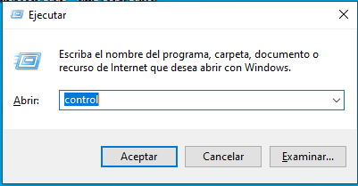
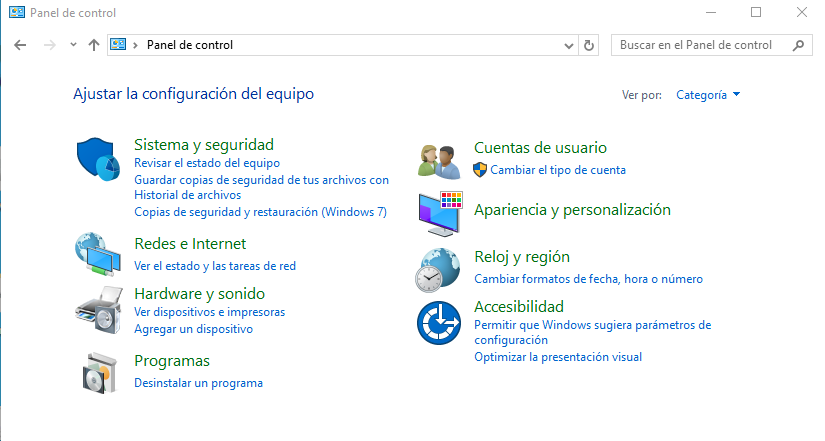
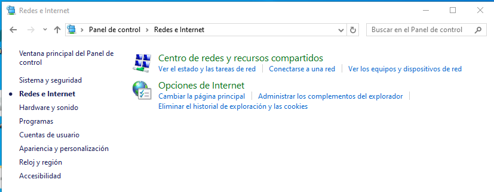
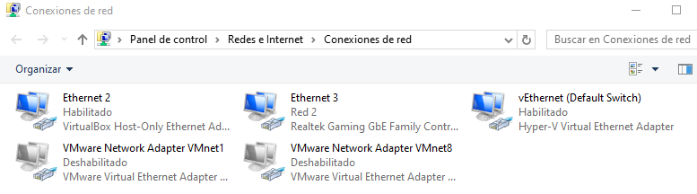
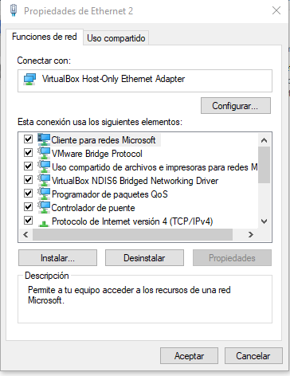
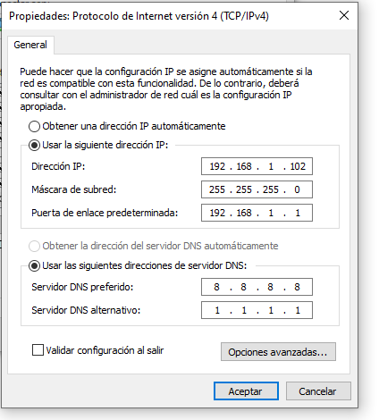
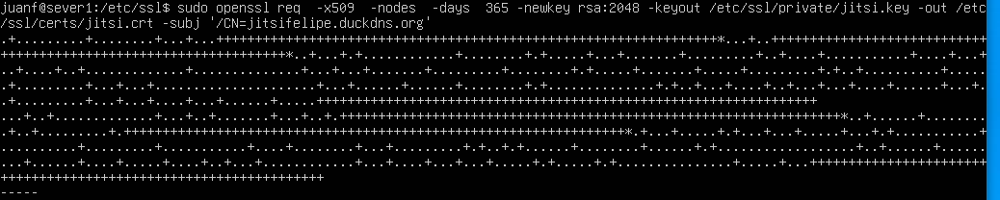
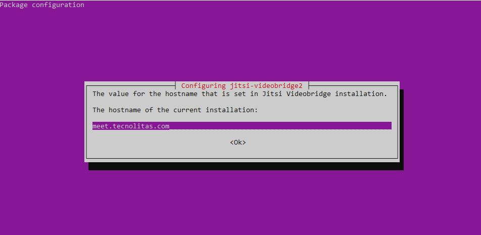

## proyecto.jitsi-meet.felipe.criollo

DOCUMENTACIÓN JITSI MEET

# Creamos las máquinas virtuales que nos indica la práctica en Hyper-V. 
* Ubuntu sever 
* Ubuntu Desktop
* Windows 10 o Windows 11
 

## Configuración de SHH
Dentro de la máquina de ubuntu server, introduciremos el siguiente comando para instalar las SSH en la misma.
```
sudo apt install shh*
```
## configuración de Ip estática
### Ubuntu Server

```
sudo nano /etc/netplan/00-installer-config.yaml
```
Editamos el archivp de configuracion de red

```
network:
  ethernets:
    eth0:
       dhcp4: no
       addresses: [192.168.1.100/24]
    eth1:
      dhcp4: yes
version: 2
```
Guardamos:
```
sudo netplan apply
```
### Ubuntu Desktop
Ejecutamos el comando y modificamos el archivo
```
sudo nano /etc/netplan/01-network-manager-all.yaml
```
Escribimos esto
```
network:
  version: 2
  ethernets:
       eth0:
           dhcp4: no
           addresses: [192.168.1.150/24]
           nameservers:
             addresses: [8.8.8.8, 8.8.4.4]
       eth1:
           dhcp4: yes
```
### Windows 10
Vamos configurar la ip

1.Abrimos el panel de control, ejecutamos Windows +R y escribimos "Control" 

---
2.Buscamos "Redes e Internet" y entramos

---
3.Buscamos "Centros de redes y recursos compartidos" y entramos

---
4.Buscamos y seleccionamos "Cambiar configuración del adaptador"

---
5.entramos en las propiedades de nuestro adaptador de red y entramos en el Protocolo de versión de internet

---
6. configuaramos la IP
   

---
---
### nginx
opcional actualizar el sistema
```
sudo apt update
```
Descargamos el paquete HTTPS
```
sudo apt install apt-transport-https
```
Descargar el repositorio universe para las dependecias 
```
sudo apt-add-repository universe
```
Actualizamos
```
sudo apt update
```
Descargamos nginx
```
sudo apt install nginx
```
Vamos habilitar el modulo SSl para nginx y luego reiniciar el servicio
```
sudo a2enmod ssl
sudo systemctl restart nginx
```

Vamos a genera el certificado autofirmado
```
sudo openssl req -x509 -nodes -days 365 -newkey rsa:2048 \
    -keyout /etc/ssl/private/jitsifelipe.duckdns.org.key \
    -out /etc/ssl/certs/jitsifelipe.duckdns.org.crt

```


Vamos a configurar mi dominio, nesecitamos crear un archivo con el nombre de mi domio en esta ruta (etc/nginx/sites-available/).
```
sudo nano /etc/nginx/sites-available/jitsifelipe.duckdns.org
```
```
<VirtualHost *:443>
    ServerName jitsifelipe.duckdns.org
    DocumentRoot /var/www/html/local
    
    SSLEngine on
    SSLCertificateFile /etc/ssl/certs/jitsifelipe.duckdns.org.crt
    SSLCertificateKeyFile /etc/ssl/private/jitsifelipe.duckdns.org.key
    
    ErrorLog ${APACHE_LOG_DIR}/error.log
    CustomLog ${APACHE_LOG_DIR}/access.log combined
</VirtualHost>

```
Vamos habilitar el sitio y recargar la configuarción
```
sudo a2ensite jitsifelipe.duckdns.org.conf
sudo systemctl reload nginx

```

---
### Jitsi meet
1. Ejecutamos
```
sudo apt update && sudo apt upgrade -y
sudo apt install wget curl gnupg2 apt-transport-https -y
```
2. Configuramos el firewall
```
sudo ufw allow 80/tcp    
sudo ufw allow 443/tcp    
sudo ufw allow 10000/udp  
sudo ufw status
``` 
3. Agregar el repositorio oficial Jitsi meet
```
echo 'deb https://download.jitsi.org stable/' | sudo tee /etc/apt/sources.list.d/jitsi-stable.list

```
4. Importamos la clave GPG de jitsi meet
```
wget -qO - https://download.jitsi.org/jitsi-key.gpg.key | sudo apt-key add -
sudo sh -c "echo 'deb https://download.jitsi.org stable/' > /etc/apt/sources.list.d/jitsi-stable.list"
sudo apt update
```
5. Actulizamos
```
sudo apt Update
```
6. Instalamos jitsi
```
sudo apt install jitsi-meet
```


Al intentar conectarme al sevidor no me de deja el fariwall
